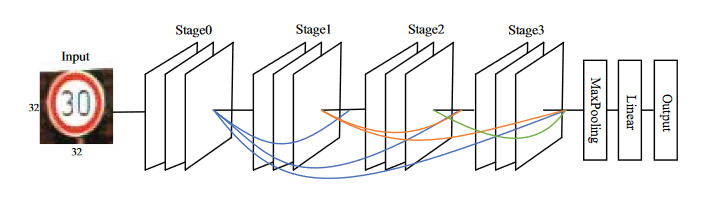
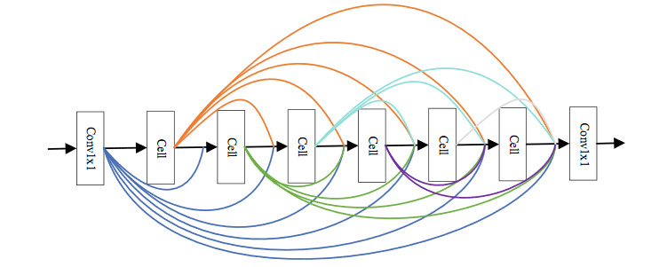
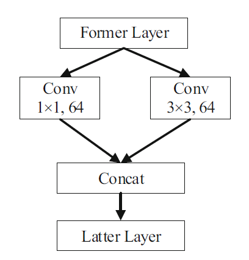
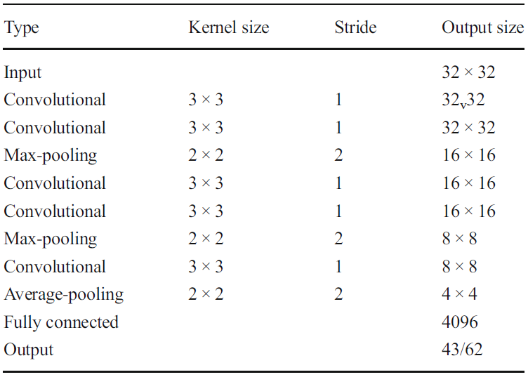
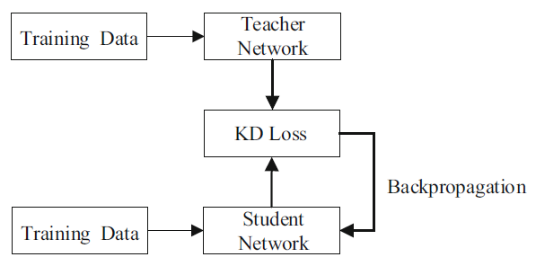
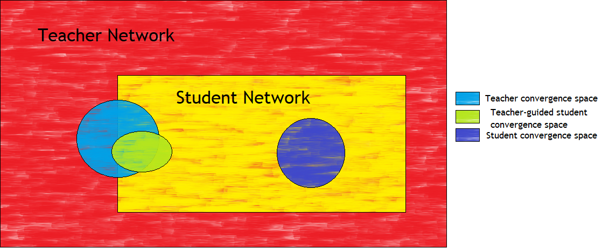
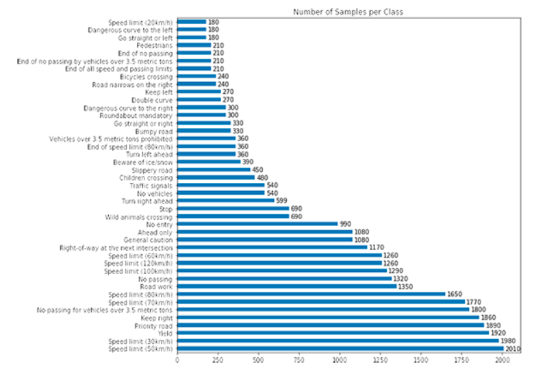

# Lightweight Traffic Sign Classification

## Introduction

Traffic sign classification is the task of identifying and recognizing the different types of traffic signs that are found. Traffic sign classification is an integral part of autonomous vehicles, more popularly known as self-driving cars as it would enable the car to understand the traffic rules and adhere to traffic laws without human intervention. This is also a real-time classification task and any delay in correctly identifying a traffic sign would be life-threatning, be it for the passengers in the autonomous vehicles, or people in the immediate vicinity of the vehicle including pedestrians and cyclists. Additionally, since the classification systems are deployed in a resource-constrained environment, the network has to be lightweight, robust and highly accurate.  

In [1], Zhang et. al. proposed two unique lightweight networks that can obtain higher recognition precision while preserving less trainable parameters in the models. The first network is a teacher model which is trained on the GTSRB dataset, and the second network is a simple five-layer convolutional neural network which learns from the teacher model through knowledge distillation. For our project, we aim to reproduce the model proposed in the paper from scratch. There is no existing code implementation of this paper as released by the authors, or as an independent implementation. We use the model architectures and the hyperparameters given in the paper to achieve results as close as possible to the ones described in the paper. We also attempt to describe any discrepancies that may arise between the paper's results and the results obtained by us.

## Related Work

### Existing Object-Identification Networks
There are existing deep neural networks which can identify objects, and specifically traffic signs[2], with significant accuracy. Traditional traffic sign classification networks which use extreme learning machines(ELM)[3] or support vector machines[4][5] for feature classes use handcrafted features which results in significant loss of information. CNNs like MSCNN[6], MCDNN[7], CNN-ELM[8] take advatage of traditional learning classifiers and achieve greater recognition rate as compared to the traditional methods. CNN-HLSGD[9] trains a CNN with hinge loss and achieves a recognition rate on the GTSRB dataset better than that of most methods.

### Limitations of Existing Networks 
Though these networks perform very well on the traffic sign classification task, they are not suitable to be deployed in a resource-constrained environment with reduced computing power and storage space. A possible solution to this challenge is to compress these heavy CNNs using five different methods: low-rank, pruning, quantization, knowledge distillation, and compact network design. In [1], the authors design two networks which take advantage of the network compression techniques resulting in lightweight networks with fewer trainable parameters.

## Dataset

The paper uses the German Traffic Sign Recognition Benchmark dataset which is a multi-class, single-image dataset consisting of more than 50,000 images with unique physical traffic sign instances. Since the images are of actual real-life traffic signs, the images also reflect real-life image identification challenges like varying perspectives, shades, lighting conditions and colour degradation. A sample of the dataset is shown in figure 1. The dataset is split into training and test sets with 39,209 images in the training set and 12,630 images in the test set.

![Figure 1: A sample of the GTSRB dataset[10]](assets/Overview-of-the-GTSRB-Dataset.png?raw=true)
*Figure 1: A sample of the GTSRB dataset[10]*

We have also trained our teacher model on the CIFAR-10[11] dataset which consists of 60000 32x32 colour images in 10 classes, with 6000 images per class. There are 50000 training images and 10000 test images. Figure 2 shows the classes in the dataset, along with 10 images from each class.

*Figure 2: Classes from the CIFAR-10 dataset[11]*

## Network Architecture

The authors of this paper have designed two novel lightweight networks for the traffic sign classification task. To summarize, the network primarily consists of a large neural network called the teacher model which is trained on the GTSRB dataset and transfers its knowledge to a smaller network called the student model through knowledge distillation. An overview of the architecture is given in figure 3. We elaborate on each of the components in the sections below.

*Figure 3: A high-level overview of the teacher-student architecture*

### Teacher Network

The teacher network is usually a complex and deep network which is fully trained offline as it requires high computational performance. 

The architecture of the teacher network is shown in figure 4. It consists of two 1x1 convolutional filters that are used to reduce the number of channels of the input feature maps. Using 1x1 instead of 3x3 kernels reduces the number of parameters by one-ninth, while also increasing the non-linearity of the network without changing the size of the feature maps, thereby deepening the network. This is depicted in figure 5, which shows the network's stage module. Inside each cell, the input is spliced and there is a 1x1 kernel and a 3x3 kernel that perform convolutional operations in parallel. The output is then concatenated and passed on to the next layer. The cell operations can be visualized in figure 6. From the architecture of the teacher network, we can observe that there are six cells that are used to connect the different layers and taking advantage of the feature maps of each layer while also accumulating the characteristics of each channel. This relieves us of the vanishing gradient problem. As part of the convolutional operations, batch normalization and ReLU functions are performed in each layer to further avoid the vanishing gradient and gradient explosion problems while also incresing the degree of non-linearity in the network. At the end of stage 3, a 2x2 maxpooling operation is done followed by a linear layer which fully connects all neurons from the penultimate layer to the classfication layer.

*Figure 4: Architecture of the teacher network*

The teacher network is trained to converge on the same training set as the student network. The parameters of the teacher network are not updated during the training of the student model, as they only guide the updating of the student network parameters. The performance of the student network is dependent on the performance of the teacher network, so if the teacher network has a low accuracy on the training set, it is difficult to guide the student model to update parameters, and the student model may get stuck in a local optima.

*Figure 5: A stage module*

*Figure 6: A cell block*

### Student Network

The student network has a simple end-to-end architecture consisting of five convolutional layers and a fully connected layer. Each type of convolutional filter in a convolutional layer are used to extract specific features of an image. Similar to the teacher network, a batch normalization layer and a ReLU layer are added in each convolutional layer to increase the non-linearity in the network. Max-pooling layers are used after the second and fourth convolutional layers to obtain textural features and an average pooling layer is used after the final convolutional layer to preserve the information of the input feature maps. The pooling layers also prevent overfitting and reduce the dimensionality of the feature maps. Finally, there is a fully connected layer or the classifier layer that transfers the feature vectors into a target class probability. The optimizer used to update weights and bias during the training is the Adam optimizer. The student network learns low-level information like texture from the low-level convolutional features, whole learning semantic information from the high-level convolutional layers. Figure 7 gives an overview of the student network.

*Figure 7: An overview of the student network*

### Knowledge Distillation

Knowledge obtained from the teacher network is transferred to the student network through the process of knowledge distillation. An overview of the knowledge distillation process is given in figure 8. The softened output of the teacher network is used to train the student network on the target datasets. Consider the training sets to be represented as $$ D = \{X = \{x_1, x_2,..., x_n\}, \{Y = \{y_1, y_2,..., y_n\}\} $$, where $$x$$ and $$y$$ represent an input and a target output respectively. The output of the teacher model and the student model can be represented as $$t = teacher(x)$$ and $$s = student(x)$$ respectively. The student model minimizes the knowledge distillation loss function defined below:

$$ L_{KD} = (1-\alpha)L_{CE}(y, \sigma(s)) + 2T^2\alpha L_{CE}(\sigma(\frac{t}{T}), \sigma(\frac{s}{T})$$

where $$\alpha$$ is a hyperparameter that controls the ratio of the two terms and $$Ta$$ is a temperaturue parameter, $$\sigma()$$ is the softmax function  and $$L_{CE}$$ is a standard cross-entropy loss function.

*Figure 8: Knowledge Distillation Process*

### Advantages of the Teacher-Student Architecture

One of the advantages of the teacher student architecture is that the student network only learns the most significant information from the teacher model. The student learns a one-hot class label directly from the traffic sign learning. Stating the example given in the paper, consider an object classification network trained to recognize a car, a cat or a dog, and the likely probabilities of an object being one of these three is [0.05, 0.9, 0.6]. This is a softened output, and since cars are more different that cats or dogs, the difference between the second and the third probablities is smaller than the difference between the first and the second. Since this information only makes a minimal contribution to the weights update, the temperature parameter T is increased to help transfer the knowledge to the student model. 

Another advantage is that since the student network is guided by the teacher network, its convergence space becomes significantly smaller as compared to a model learning directly from a dataset. A visualization is shown in figure 9. The search space is much larger for a traditional network trained directly on a training dataset. We assume that convergence similar to the teacher network can be achieved by the student network too, and so the convergence space of the teacher and student network should overlap. The student network can also have convergence different than that of the teacher network, but given that the student network is guided by the teacher network, the convergence space of the student network will signigicantly overlap with the convergence space of the teacher network.

*Figure 9: Teacher-student convergence space*
### Hyperparameters

We have used the same hyperparameters as the authors. For knowledge distillation, we set $$T$$ to 20 and $$\alpha$$ to 0.9 for optimal results. The learning rate is set to 0.001, and individual adaptive learning rates are computed using the Adam method with a weight decay of 10-5.

## Experiment

### Data Preprocessing 

Before we started using the German Traffic Sign Recognition Dataset, there was some amount of pre-processing required to be accessed through the Dataloader class of torchvision in PyTorch module. For this purpose, we make use of a publicly available code which loads the GTSRB data into a wrapped torchvision Dataset. The loader can be found [here.](https://github.com/tomlawrenceuk/GTSRB-Dataloader) The loader overrides the torchvision Dataset class and loads the respective training and test sets into the dataframe and produces a Dataset containing the images and the class Ids of the data. Using the Dataloader class, we then load the processed data into mini-batches of batch-size = 64, using the overloaded GTSRB class.

### Implemented Network Architecture

Due to resource constraints on our individual machines, we decided to reduce the feature maps in the network described in the base paper. 

For the teacher network, we used a growth rate of k = 64 between the cells and the stages. What this means, is that each cell module outputs 'k' or 64 feature maps which are then densely connected to the remaining cells in the stage. Similarly, the final 1 x 1 convolutional layer also produces 'k' or 64 feature maps which are also densely connected to the subsequent stages. Our network contains 32 convolutional layers and 3823339 (~3.8 million) trainable parameters. Due to its reduced growth size, its significantly lesser than the number of parameters cited by the authors ~ 7.3 million. The Stage, Pooling and Linear layers are described below:

| Layer   | Type    | In-filters | Out-filters | h  | w  | Kernel | Stride | Padding |
|---------|---------|------------|-------------|----|----|--------|--------|---------|
| Stage-0 | Conv1   | 3          | 64          | 32 | 32 | 1      | 1      | 0       |
| Stage-0 | Conv2   | 448        | 64          | 32 | 32 | 1      | 1      | 0       |
| Stage-1 | Conv1   | 64         | 64          | 32 | 32 | 1      | 1      | 0       |
| Stage-1 | Conv2   | 448        | 64          | 32 | 32 | 1      | 1      | 0       |
| Stage-2 | Conv1   | 128        | 64          | 32 | 32 | 1      | 1      | 0       |
| Stage-2 | Conv2   | 448        | 64          | 32 | 32 | 1      | 1      | 0       |
| Stage-3 | Conv1   | 192        | 64          | 32 | 32 | 1      | 1      | 0       |
| Stage-3 | Conv2   | 448        | 64          | 32 | 32 | 1      | 1      | 0       |
| Pooling | Maxpool | 256        | -           | 16 | 16 | 2      | 2      | 0       |
| FC      | Linear  | 65536      | 43          | -  | -  | -      | -      | -       |

The stages also contain six densely connected cells between the two convolutional layers(Conv1 and Conv2), which are described below:

| Layer | Type  | In-filters | Out-filters | h  | w  | Kernel | Stride | Padding |
|-------|-------|------------|-------------|----|----|--------|--------|---------|
| Cell0 | Conv1 | 32         | 32          | 32 | 32 | 1      | 1      | 0       |
| Cell0 | Conv3 | 32         | 32          | 32 | 32 | 3      | 1      | 1       |
| Cell1 | Conv1 | 64         | 32          | 32 | 32 | 1      | 1      | 0       |
| Cell1 | Conv3 | 64         | 32          | 32 | 32 | 3      | 1      | 1       |
| Cell2 | Conv1 | 96         | 32          | 32 | 32 | 1      | 1      | 0       |
| Cell2 | Conv3 | 96         | 32          | 32 | 32 | 3      | 1      | 1       |
| Cell3 | Conv1 | 128        | 32          | 32 | 32 | 1      | 1      | 0       |
| Cell3 | Conv3 | 128        | 32          | 32 | 32 | 3      | 1      | 1       |
| Cell4 | Conv1 | 160        | 32          | 32 | 32 | 1      | 1      | 0       |
| Cell4 | Conv3 | 160        | 32          | 32 | 32 | 3      | 1      | 1       |
| Cell5 | Conv1 | 192        | 32          | 32 | 32 | 1      | 1      | 0       |
| Cell5 | Conv3 | 192        | 32          | 32 | 32 | 3      | 1      | 1       |

For our experiments, we also train two different student networks using the Knowledge Distillation process described earlier. We used the 50% pruned student network described in the base paper as the student model to train. The student model thus formed has 5 convolutional layers, 2 max pooling layers, 1 average pooling layer and a fully connected linear layer, with only ~ 3.2 x 105 parameters. The description of the network is provided below:

| Layer   | in-filters | out-filters | h  | w  | kernel | stride | Pad |
|---------|------------|-------------|----|----|--------|--------|-----|
| Conv1   | 3          | 32          | 32 | 32 | 3      | 1      | 1   |
| Conv2   | 64         | 32          | 32 | 32 | 3      | 1      | 1   |
| Maxpool | 64         |             | 16 | 16 | 2      | 2      | 0   |
| Conv4   | 64         | 64          | 16 | 16 | 3      | 1      | 1   |
| Conv5   | 64         | 64          | 16 | 16 | 3      | 1      | 1   |
| Maxpool | 64         |             | 8  | 8  | 2      | 2      | 0   |
| Conv7   | 128        | 128         | 8  | 8  | 3      | 1      | 1   |
| AvgPool | 128        |             | 4  | 4  | 2      | 2      | 0   |
| FC      | 2048       | 43          |    |    |        |        |     |

The second student network created was a shallower model containing 3 Convolutional Layers, 2 Max Pooling layers and a fully connected layer,  with only ~ 1.2 x 105 parameters. The description of the network is provided below:

| Layer   | in-filters | out-filters | h  | w  | kernel | stride | Pad |
|---------|------------|-------------|----|----|--------|--------|-----|
| Conv1   | 3          | 32          | 32 | 32 | 3      | 1      | 1   |
| Conv2   | 32         | 64          | 32 | 32 | 3      | 1      | 1   |
| Maxpool | 64         |  -          | 16 | 16 | 2      | 2      | 0   |
| Conv3   | 64         | 32          | 16 | 16 | 3      | 1      | 1   |
| Maxpool | 32         |  -          | 8  | 8  | 2      | 2      | 0   |
| FC      | 2048       | 43          |  - |  - |  -     |  -     |  -  |

##$ Implementing the Loss Function

For the teacher network, we use Cross Entropy Loss between the predicted outputs and the target labels of the training dataset.

The loss function for Knowledge Distillation as described earlier uses Cross-Entropy Loss between the softmax teacher output and the softmax of student outputs. However, after initially trying to implement this using Pytorch's Cross Entropy Loss function, we realised that accepts softmax outputs and scalar target labels as parameters which did not fit our requirements. To overcome this problem, we made use of KL Divergence which takes softmax probabilities and log of softmax probabilities as input parameters. The KL Divergence loss and Cross Entropy Loss between the student output and target labels are added to compute the Knowledge Distillation Loss for the student network's training.

### Running on Google Colab with a GPU

We first trained the Teacher model on a Tesla K80 GPU on Google Colab with a batch size of 64 for 501 epochs. The trained model is then saved to be used later for the training of the student network using knowledge distillation. We validate the teacher model on the test set during every epoch of its run and plot the loss and accuracy curves. We also compute the confusion matrix of the trained teacher model and compute the True Positives, True Negatives, False Positives, False Negatives, Precision, Recall, F1 Score and Accuracy of the network for the individual classes in the test set. 

The trained teacher model is also used to train the student networks using Knowledge distillation. We load the teacher model and store its predicted labels on the training set and use the labels to train the student network. We train the two student network with a batch size of 64, for 200 and 140 epochs respectively with a learning rate of 0.001 and hyperparameters $$\alpha = 0.9$$ and $$T = 20$$. We validate the teacher network against the test set at every epoch and plot the results. For the student network described in the paper, we also compute the confusion matrix and report its true positives, true negatives, false positives, false negatives, precision, recall, F1 Score and accuracy for the individual classes.

The results of these are discussed further in the Results section.

### Running on Google Colab with a TPU  
To train the models with the batch size mentioned in the paper, we took advantage of the Google Colab TPU offering. The changes to our teacher training model notebook were not trivial. The main processes spawns 8 child processes, which is the number of cores in the TPU, and training data is loaded onto each of the devices using a distributed sampler. The training took around 50 hours, and achieved accuracy comparable to the models trained on the GPU. The only significant difference we noticed was the performance improvement and the faster training time on the TPU. The notebook is available [here](https://github.com/RPraneetha/lightweight-traffic-sign-classification/blob/master/notebooks/g20_teacher_net_TPU.ipynb).

## Results

## Challenges Faced

### Training the models
The major challenge we faced was in the training of the teacher model. The authors have performed their experiments with PyTorch on a Linux PC with an Intel® Xeon(R), CPU E5-2670 v3@2.30 GHz×24 and an NVIDIA TITAN X, 12 GB RAM. We attempted to replicate their experiment on a Windows PC with Intel® Core™ i7-9750H CPU @ 2.60GHz and NVIDIA GeForce RTX 2060 with a batch size of 128, but were faced with a CUDA out-of-memory error. We faced the same issue when we reduced the batch size to 64. We could run the model only with a batch size of 32 for 300 epochs but this led to an abysmal accuracy of 18%. We had requested access to the university high performance cluster, but were given only 1 GPU limit and were similarly unable to completely run train the teacher network on the cluster either. We were finally able to train the model on the GTSRB dataset by running the model on Google Colab in 12-hour batches with a reduced batch size of 64. Google Colab has usage limits where a user is given a cool-off period if they utilize GPU-intensive resources for 12-hours, and due to this it took us more than 4 days to train the model. We were only able to train with a batch-size of 128 when we run the model in Google Colab on an 8-core Tensor Processing Unit(TPU) using multiprocessing, which took approximately 4-5 days.

## Inference

### Limitations

One of the limitations of our approach is that we do not account for the class skew in the GTSRB dataset, which could potentially introduce a bias in our models. A distribution of the classes in the dataset is given in figure 10.

*Figure 10: Distribution of classes in the GTSRB Dataset*

## Future Work

Some of the potential future work for our project, including ways the architecture can be improved are outlined below:

* Network Pruning is a common method to compress large networks and reduce the number of trainable parameters. Network pruning reduces the number of trainable parameters by removing redundant parameters in the network. 

* Data augmentation - The data can be augmented by performing operations like rotations and translations. The images in the GTSRB dataset are low-resolution images with poor contrast. This can be improved upon with data augmentation and the results from the models trained on the augmented dataset can be compared with the original models.

* Real time from video - The network can be further extended to recognize traffic signs from video clips in real-time. The network can also be mounted as a protoype on an autonmous vehicle to test the real-life applicability and viability of the models. This also gives us an opportunity to test the performance of the network in the real-world.

## References
[1] Zhang, J., Wang, W., Lu, C. et al. Lightweight deep network for traffic sign classification. Ann. Telecommun. (2019). https://doi.org/10.1007/s12243-019-00731-9

[2] J. Stallkamp, M. Schlipsing, J. Salmen, C. Igel, Man vs. computer: Benchmarking machine learning algorithms for traffic sign recognition, Neural Networks, Available online 20 February 2012, ISSN 0893-6080, 10.1016/j.neunet.2012.02.016. (http://www.sciencedirect.com/science/article/pii/S0893608012000457) Keywords: Traffic sign recognition; Machine learning; Convolutional neural networks; Benchmarking

[3] Wang G, Ren G,Wu Z, Zhao Y, Jiang LH (2013) A robust, coarse-to-fine traffic sign detection method. In: Proceedings of the 2013
International Joint Conference on Neural Networks (IJCNN), pp754–758

[4] ChenY, XuW, Zuo J,YangK(2018) The fire recognition algorithm using dynamic feature fusion and IV-SVMclassifier. Clust Comput.
https://doi.org/10.1007/s10586-018-2368-8. Accessed 30 Jun 2020

[5] Chen Y, Xiong J, Xu W, Zuo J (2018) A novel online incremental and decremental learning algorithm based on variable support vector
machine. Clust Comput. https://doi.org/10.1007/s10586-018-1772-4. Accessed 30 Jun 2020

[6] Sermanet P, LeCun Y (2011) Traffic sign recognition with multiscale convolutional networks. In: Proceedings of the 2011 International Joint Conference on Neural Network (IJCNN), pp2809–2813

[7] Ciregan D, Meier U, Masci J, Schmidhuber J (2012) Multi-column deep neural network for traffic sign classification. In: Proceedings
of IEEE conference on computer vision and pattern recognition (CVPR), pp 3642–3649

[8] Zeng Y, Xu X, Fang Y, Zhao K (2015) Traffic sign recognition using deep convolutional networks and extreme learning machine.
In: Proceedings of International Conference on Intelligence Science and Big Data Engineering (IScIDE), pp 272–280

[9] Jin J, Fu K, Zhang C (2014) Traffic sign recognition with hinge loss trained convolutional neural networks. IEEE Trans Intell Transp
Syst 15:1991–2000

[10] An Efficient Traffic Sign Recognition Approach Using a Novel Deep Neural Network Selection Architecture: Proceedings of IEMIS 2018, Volume 3 - Scientific Figure on ResearchGate. Available from: https://www.researchgate.net/figure/Overview-of-the-GTSRB-Dataset_fig1_327389916 [accessed 30 Jun, 2020]

[11] Krizhevsky A (2009) Learning multiple layers of features from tiny images. Technical Report TR–2009, University of Toronto. http://
www.cs.toronto.edu/~kriz/learning-features-2009-TR.pdf. Accessed 30 Jun 2020